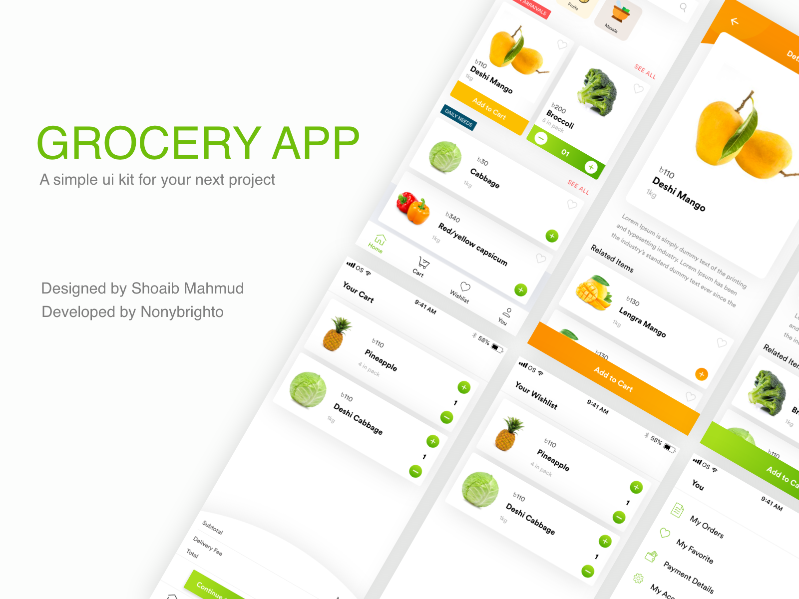
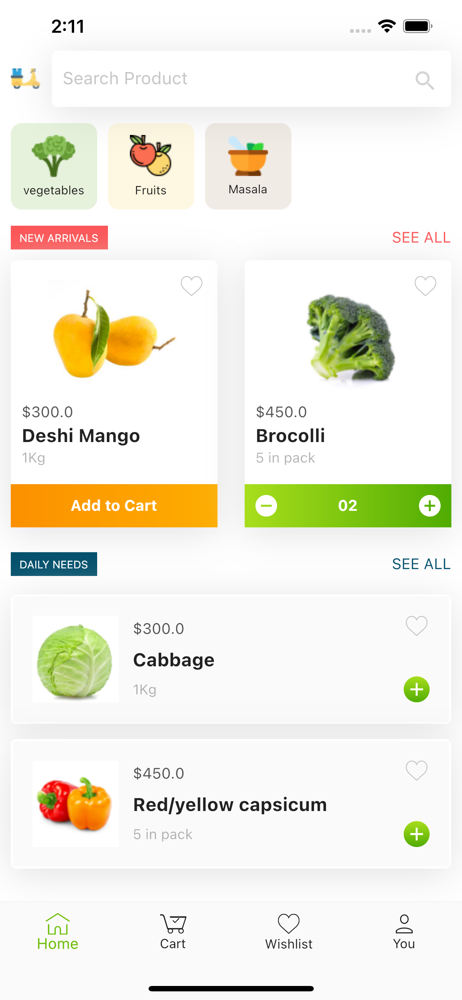
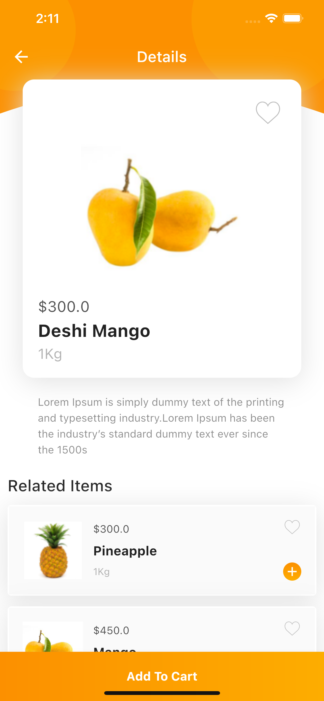
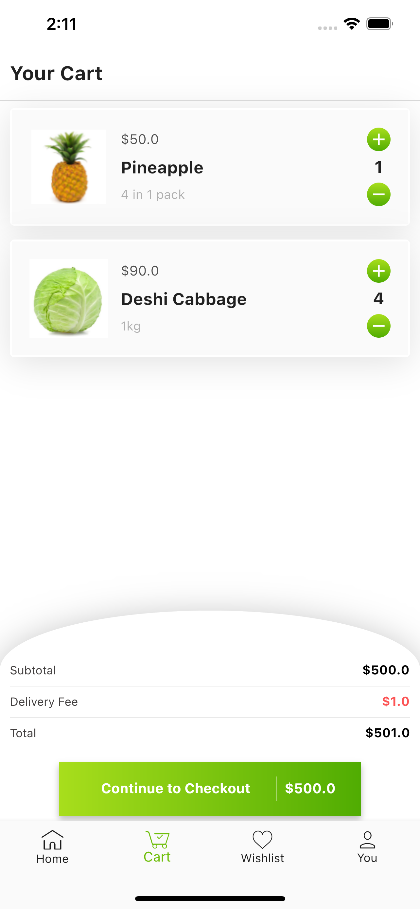
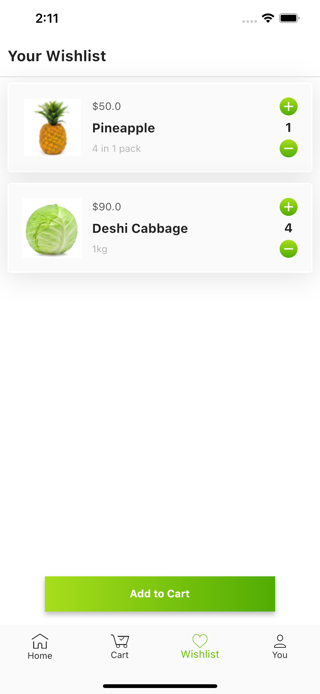
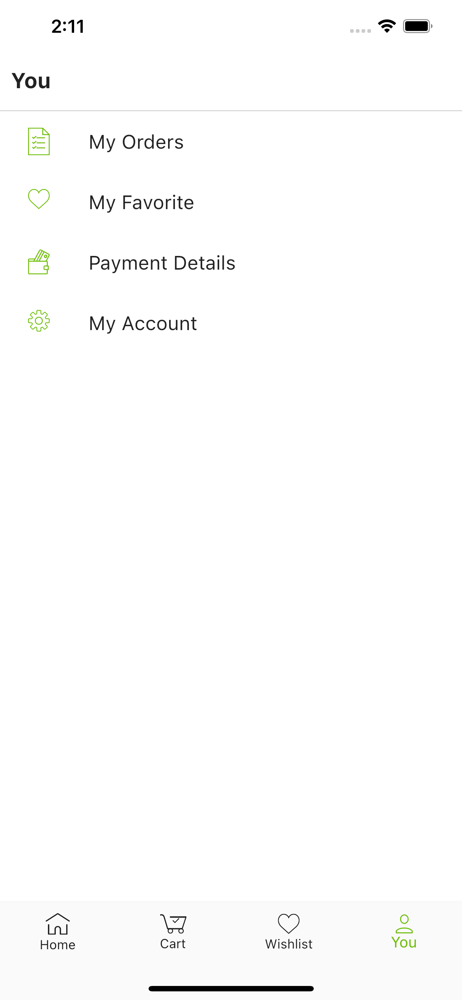

# Grocery Ecommerce App

A beautiful flutter UI developed by nonybrighto and designed by [Shoaib Mahmud.](https://www.uplabs.com/posts/grocery-app-kit)

## Overview

## Screenshots

Screenshots from the developed flutter application

  

  

## Mentions

The UI is designed by Shoaib Mahmud. located [here](https://www.uplabs.com/posts/grocery-app-kit)

For help getting started with Flutter, view it's
[online documentation](https://flutter.dev/docs), which offers tutorials,
samples, guidance on mobile development, and a full API reference.
